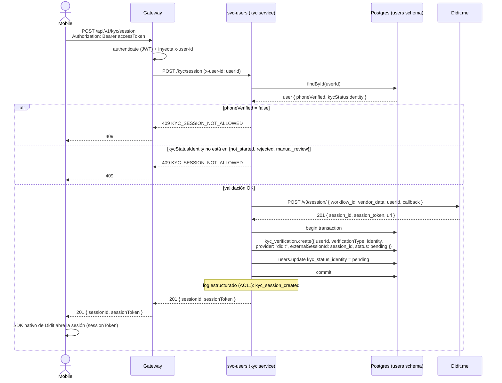
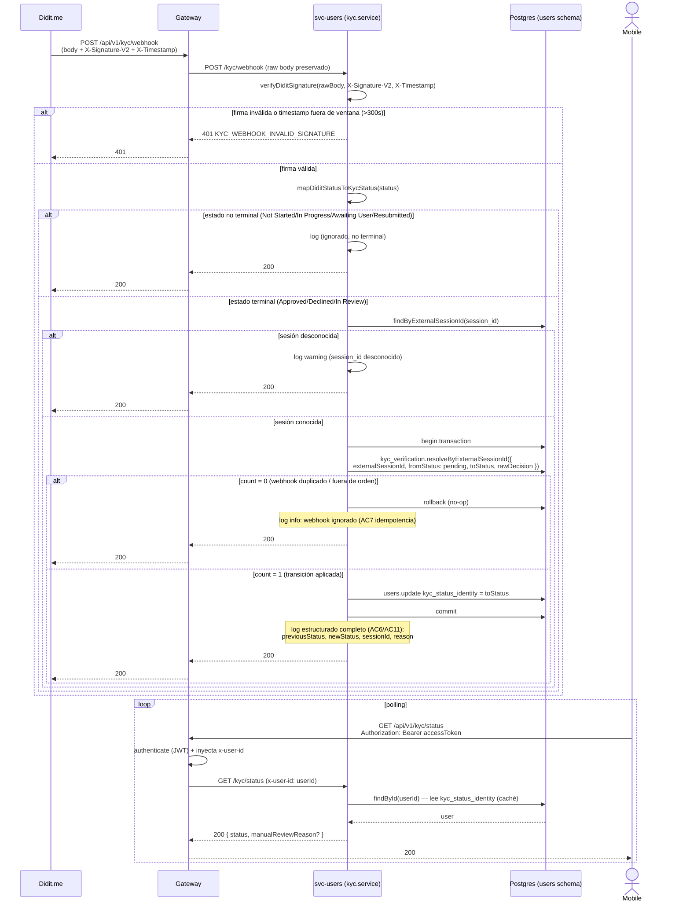

# MOVO-72 — Diagrama de secuencia: integración con Didit.me

Flujo completo de verificación KYC de identidad: creación de sesión y resolución
asincrónica vía webhook. Sirve como contrato visual de diseño (Paso 0 del plan de
MOVO-72) — se ajusta si algo cambia durante la implementación.

**Actualizado en la revisión de PR #51 (tmvergara)**: `POST /kyc/session` y
`GET /kyc/status` pasaron de públicas (`userId` explícito) a protegidas — desde que
`POST /auth/register` emite tokens de sesión (mismo cambio), el `userId` se deriva del
JWT (header `x-user-id` que inyecta el gateway, ADR-010), no de un parámetro que
cualquiera podía adivinar. MOVO-94 queda resuelto por este cambio, no solo mitigado.

## Creación de sesión (`POST /kyc/session`)

## Resolución vía webhook (`POST /kyc/webhook`)

