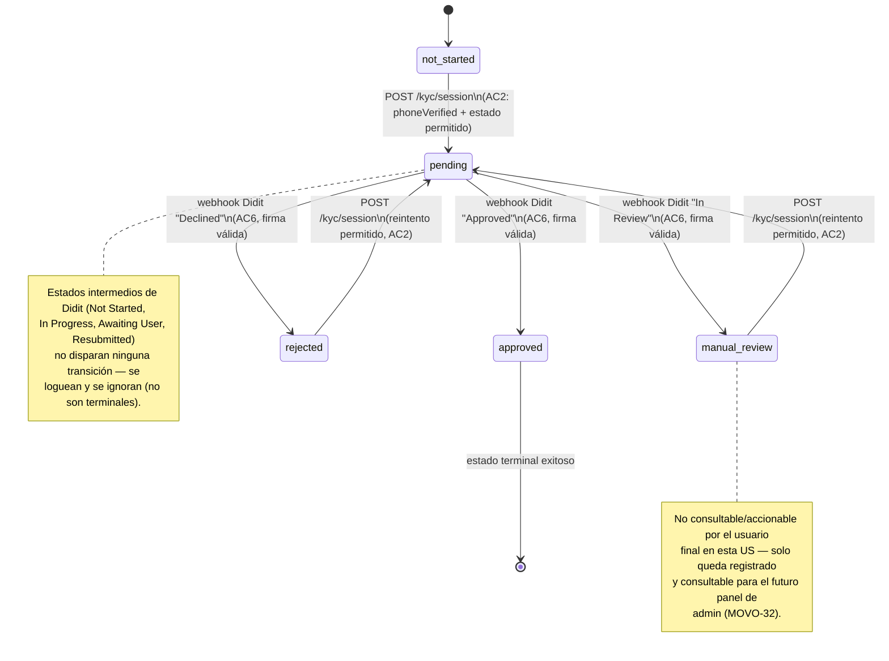

# MOVO-72 — Diagrama de estados: `kyc_status_identity`

Máquina de estados de `KycStatus` (`@movo/shared`) aplicada a `User.kycStatusIdentity`.
Cada intento individual queda además registrado como una fila en
`users.kyc_verification` (`verificationType: identity`) — este diagrama modela el estado
vigente del usuario, no el historial completo de intentos.

Sirve como contrato visual de diseño (Paso 0 del plan de MOVO-72) — se ajusta si algo
cambia durante la implementación, en particular el mapeo de los estados no-terminales de
Didit (`Expired`/`Abandoned`/`Kyc Expired`) que se confirma contra el sandbox real
(Paso 7 del plan).

## Transiciones no permitidas (rechazadas explícitamente)

- `POST /kyc/session` con `kyc_status_identity = pending` → `409 KYC_SESSION_NOT_ALLOWED`
  (no se reintenta ni se devuelve la sesión existente).
- `POST /kyc/session` con `kyc_status_identity = approved` → `409
  KYC_SESSION_NOT_ALLOWED` (ya verificado, no hay razón de negocio para re-verificar en
  el alcance de esta US).
- Webhook que intenta transicionar un intento que no está en `pending` (ya resuelto por
  un webhook anterior) → ignorado, sin cambio de estado (AC7, idempotencia).
