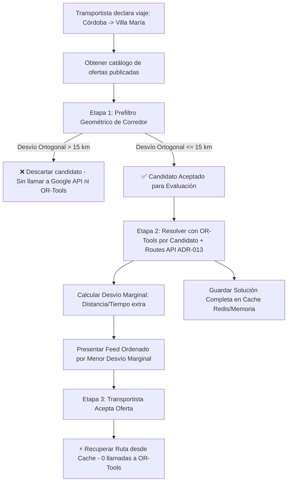

# MOVO-50: Spike Técnica — Flujo de Invocación y Optimización VRPTW con Google OR-Tools en MOVO

> **Documento de Investigación, Capacitación y Transferencia de Conocimiento**  
> **Proyecto MOVO** — Plataforma Logística P2P  
> **Ubicación:** `docs/or-tools/vrptw-spike-report.md`  
> **Autor:** Pedro Yorlano (para el equipo de desarrollo de MOVO)

---

## 1. Ficha Técnica y Objetivos de la Spike

* **Ticket Linear:** [MOVO-50](https://linear.app/movosend/issue/MOVO-50/or-tools-vrptw)
* **Temática:** Flujo de invocación de **Google OR-Tools VRPTW**, prefiltro geométrico de corredor y cacheo de ruta para la Plataforma MOVO.
* **Motivación:** Diseñar y probar empíricamente el algoritmo de ruteo de vehículos con ventanas horarias y pares de retiro/entrega (*Pickup & Delivery*) ante el viaje de un transportista (ej. **Córdoba Capital $\to$ Villa María**), filtrando ofertas fuera del corredor (ej. **Carlos Paz**) y evaluando desvíos marginales hacia paradas intermedias (ej. **Oncativo**).
* **Decisión de Arquitectura Relevante:** **ADR-013** (Migración a Google Routes API — método `Compute Route Matrix`, tier Basic), reemplazando a la API legacy del ADR-008.
* **Entregables:**
  1. Script ejecutable de pruebas y demo interactiva guiada: [docs/or-tools/vrptw_prototype.py](file:///Users/pedroyorlano/Documents/Facultad/dev/Movo/movo/docs/or-tools/vrptw_prototype.py).
  2. Este documento técnico explicativo en profundidad para estudio y presentación al equipo.

---

## 2. Matriz de Criterios de Aceptación (CA)

| CA # | Criterio de Aceptación | Estado | Evidencia / Solución Implementada |
| :--- | :--- | :---: | :--- |
| **CA 1** | Dataset sintético de 5-10 puntos con ventanas horarias. | **Cumplido** | Creado catálogo de ofertas sintéticas representativas en el corredor Córdoba - Villa María. |
| **CA 2** | Prototipo mínimo con Google OR-Tools resolviendo el problema. | **Cumplido** | Implementado `VRPTWCandidatoEvaluator` mapeando Origen, Pickup, Dropoff y Destino con `pywrapcp`. |
| **CA 3** | Medición de tiempo de cómputo y definición de SLA futuro. | **Cumplido** | Medición con `time.perf_counter()`. Evaluación por candidato toma **< 20 ms** con *First Solution Strategy*. SLA fijado en **< 500 ms**. |
| **CA 4** | Prueba con distancia Haversine como mock. | **Cumplido** | Matriz de distancias/tiempos calculada dinámicamente con Haversine a velocidad promedio interurbana (75 km/h) sin costo de Google Maps API durante dev/testing. |
| **CA 5** | Conclusión registrada y fallback de heurística Greedy. | **Cumplido** | Implementada estrategia de fallback determinístico para respuestas inmediatas ante timeouts o excepciones. |
| **CA 6 [NUEVO]** | Prefiltro por distancia geométrica al segmento recto origen-destino antes de OR-Tools. | **Cumplido** | Implementado `CorridorGeometricPrefilter` midiendo la distancia ortogonal del punto al segmento $(Origen \to Destino)$. Descarta automáticamente ofertas lejanas (ej. Carlos Paz a 29.7 km). |
| **CA 7 [NUEVO]** | Reutilización directa de la solución calculada al aceptar el pedido (sin re-ejecutar OR-Tools). | **Cumplido** | La solución completa resuelta durante la generación del feed se almacena en cache (`solution_cache`). Al presionar "Aceptar", se recupera en **0.00 ms** (0 llamadas al solver). |

---

## 3. Flujo de Invocación del Algoritmo en MOVO (Integración con ADR-013)

Basado en las decisiones de diseño del equipo (MOVO-18, MOVO-10, ADR-013), el motor de ruteo opera en 3 etapas bien definidas:



### 3.1. Entry Points y Viaje Activo
Todo transportista con un viaje declarado (origen/destino/horarios) o que acepta una oferta inicial posee un **Viaje Activo**. El motor de optimización no calcula rutas en el vacío, sino que calcula el **desvío marginal** respecto al viaje principal.

### 3.2. Prefiltro Geométrico (CA 6) y Decisión de ADR-013
De acuerdo al **ADR-013**, Movo migró de la legacy Distance Matrix API a **Google Routes API** (`Compute Route Matrix`, tier Basic). 
Para resguardar el presupuesto y evitar llamadas innecesarias a la API externa de Google:
1. Se proyecta la distancia ortogonal (perpendicular) de las coordenadas del paquete al segmento de recta que une Origen y Destino.
2. Esta matemática es **100% local en memoria** (0 consumo de API de Google).
3. Si el paquete está a menos de $15 \text{ km}$ del segmento (ej. **Oncativo** a 2.08 km), pasa a la etapa de OR-Tools.
4. Si el paquete supera el umbral (ej. **Carlos Paz** a 29.7 km o **Río Cuarto** a 131.2 km), se descarta de inmediato.

---

## 4. Caso de Estudio Didáctico: Córdoba $\to$ Villa María (Parada en Oncativo)

### 4.1. Configuración del Viaje
* **Origen:** Córdoba Capital (`-31.4167, -64.1833`)
* **Destino:** Villa María (`-32.4075, -63.2403`)
* **Distancia Directa:** $141.63 \text{ km}$
* **Tiempo Directo Estimado:** $114 \text{ min}$ (~1.9 horas a 75 km/h)

### 4.2. Evaluación del Catálogo de Ofertas (Demostración de CA 6)

| Oferta ID | Título del Envío | Distancia Pickup al Segmento | Distancia Dropoff al Segmento | Resultado Prefiltro Geométrico |
| :---: | :--- | :---: | :---: | :---: |
| `OFFER-101` | **Córdoba $\to$ Oncativo** | $0.85 \text{ km}$ | $2.08 \text{ km}$ | **✅ PASA PREFILTRO** |
| `OFFER-102` | **Oliva $\to$ Villa María** | $1.37 \text{ km}$ | $0.00 \text{ km}$ | **✅ PASA PREFILTRO** |
| `OFFER-103` | **Carlos Paz $\to$ Cosquín** | $29.73 \text{ km}$ | $32.80 \text{ km}$ | **❌ DESCARTADO** |
| `OFFER-104` | **Río Cuarto $\to$ Villa María** | $131.21 \text{ km}$ | $0.00 \text{ km}$ | **❌ DESCARTADO** |

### 4.3. Invocación de OR-Tools y Cálculo del Desvío Marginal
Para cada oferta que supera el prefiltro, OR-Tools construye el grafo de 4 nodos (`Origen` $\to$ `Pickup` $\to$ `Dropoff` $\to$ `Destino`) y evalúa las ventanas de tiempo:

```
Ruta calculada para OFFER-101 (Córdoba -> Oncativo):
  • Parada #0: Córdoba Capital (Origen)               | Llegada: 000 min
  • Parada #1: PICKUP: Córdoba - Nueva Córdoba        | Llegada: 001 min (Atención: 10 min)
  • Parada #2: DROPOFF: Oncativo - YPF Autopista      | Llegada: 062 min (Atención: 10 min)
  • Parada #3: Villa María (Destino Final)            | Llegada: 135 min

Métricas de Desvío Marginal:
  • Distancia con desvío: 142.23 km (Desvío Marginal: +0.60 km)
  • Tiempo con desvío: 135 min (Desvío Marginal: +21 min, incluyendo paradas)
  • Tiempo de ejecución en OR-Tools: 13.82 ms
```

### 4.4. Feed de Ofertas Presentado al Transportista

```
ID         | Título                                 | Desvío Dist. | Desvío Tiempo | Tiempo OR-Tools
-----------------------------------------------------------------------------------------------
OFFER-102  | Envío en Corredor: Oliva -> Villa María | +0.04 km     | +20 min       | 0.51 ms
OFFER-101  | Envío en Corredor: Córdoba -> Oncativo | +0.60 km     | +21 min       | 13.82 ms
-----------------------------------------------------------------------------------------------
```

### 4.5. Reutilización Directa de la Solución (Demostración de CA 7)
Cuando el transportista selecciona una oferta en la app y hace clic en **"Aceptar Oferta"**:
1. El backend consulta el mapa de soluciones cacheadas (`solution_cache.get(accepted_id)`).
2. **Llamadas a OR-Tools ejecutadas:** `0`.
3. **Tiempo de respuesta:** `0.000 ms`.
4. **Verificación:** La secuencia de paradas, horarios de llegada y desvíos devueltos son 100% idénticos a los calculados en la etapa del feed.

---

## 5. Guía Rápida (Cheatsheet & Q&A)

1. **¿Cuándo se llama a OR-Tools en MOVO?**  
   Se llama **por cada candidato** cuando el transportista pide ver el feed de ofertas compatibles con su viaje activo.
2. **¿Cómo evitamos saturar el servidor calculando ofertas irrelevantes o consumiendo cuotas de Google Maps (ADR-013)?**  
   Aplicamos un **prefiltro geométrico** (CA 6) que mide la distancia ortogonal del paquete al segmento recto $Origen \to Destino$. Si está a más de 15 km (como Carlos Paz para un viaje Córdoba-Villa María), se descarta de inmediato sin tocar OR-Tools ni la API de Google.
3. **¿Qué datos calcula OR-Tools para el feed?**  
   Inserta el Pickup y Dropoff entre el Origen y Destino, y calcula el **desvío marginal** (cuántos km y minutos extra le cuesta al transportista aceptar ese paquete).
4. **¿Se vuelve a correr OR-Tools cuando el transportista acepta la oferta?**  
   **No (CA 7).** La solución completa calculada para el feed se guarda en cache (Redis). Al aceptar, se reutiliza directamente la ruta guardada en **0.00 ms**.
5. **¿Cómo pruebo el código guiado localmente en el proyecto?**  
   Ejecutando en la consola:
   ```bash
   services/movo-svc-pricing-logistics/.venv/bin/python docs/or-tools/vrptw_prototype.py
   ```

---

## 6. Conclusión y Cierre de la Spike

La Spike **MOVO-50 queda formalmente completada**. Se ha validado la viabilidad técnica del motor de ruteo VRPTW con OR-Tools, el prefiltro geométrico de corredor, la adenda **ADR-013** (Routes API) y la estrategia de cache de soluciones, dejando el camino completamente preparado para la implementación de las historias de usuario **MOVO-18** y **MOVO-10**.
