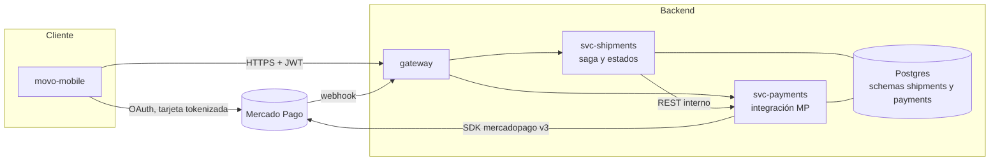
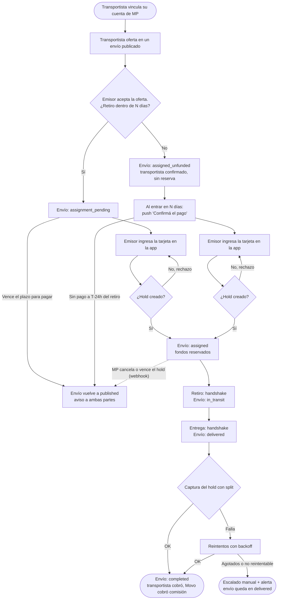
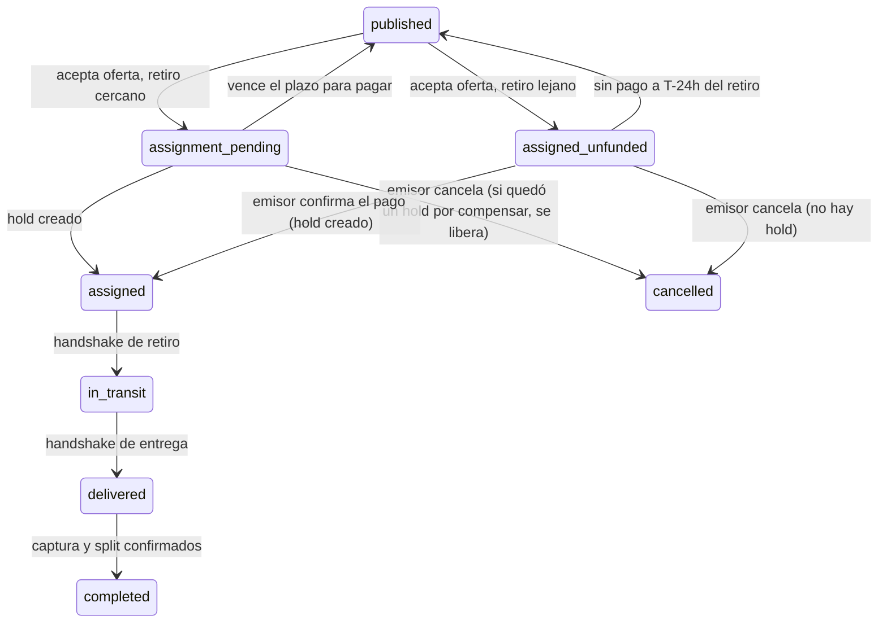
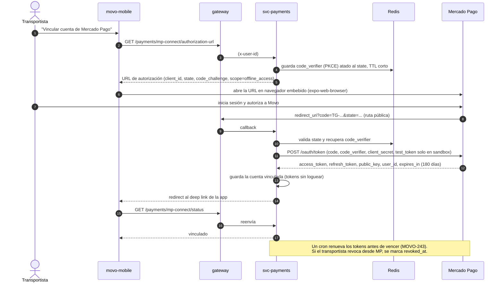
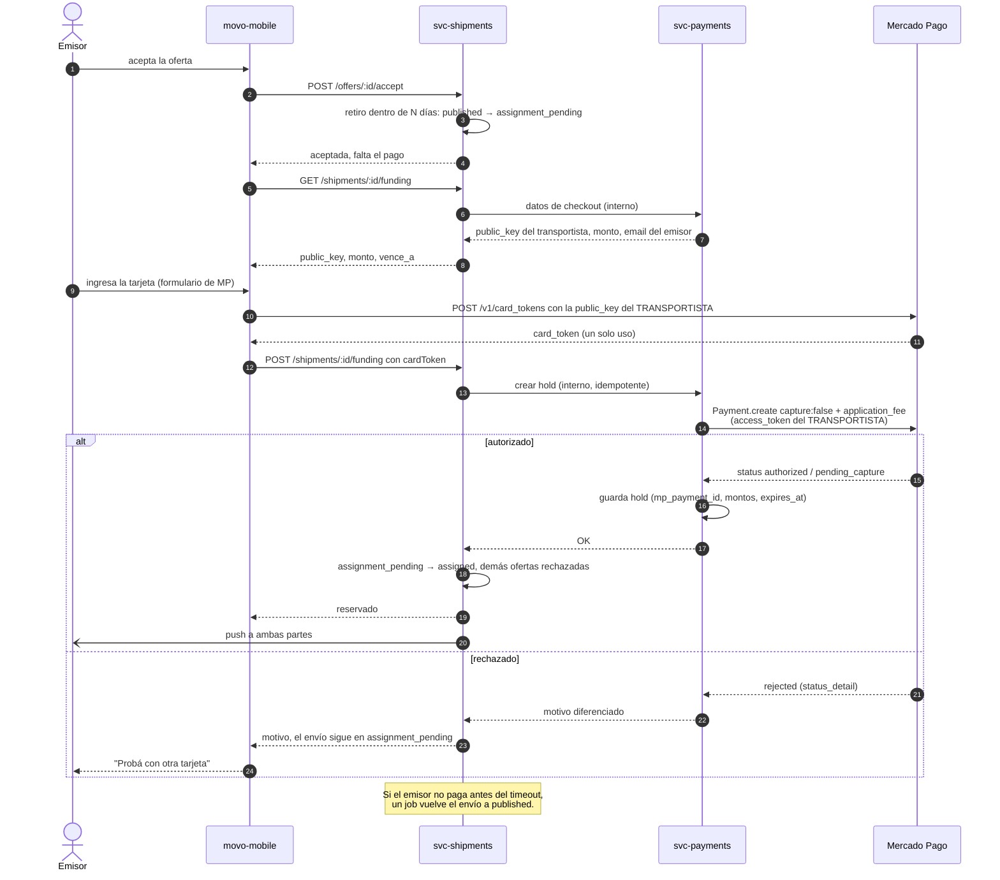
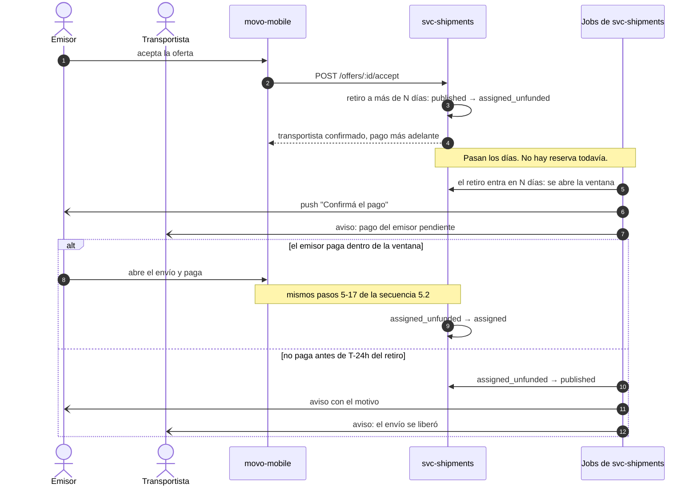
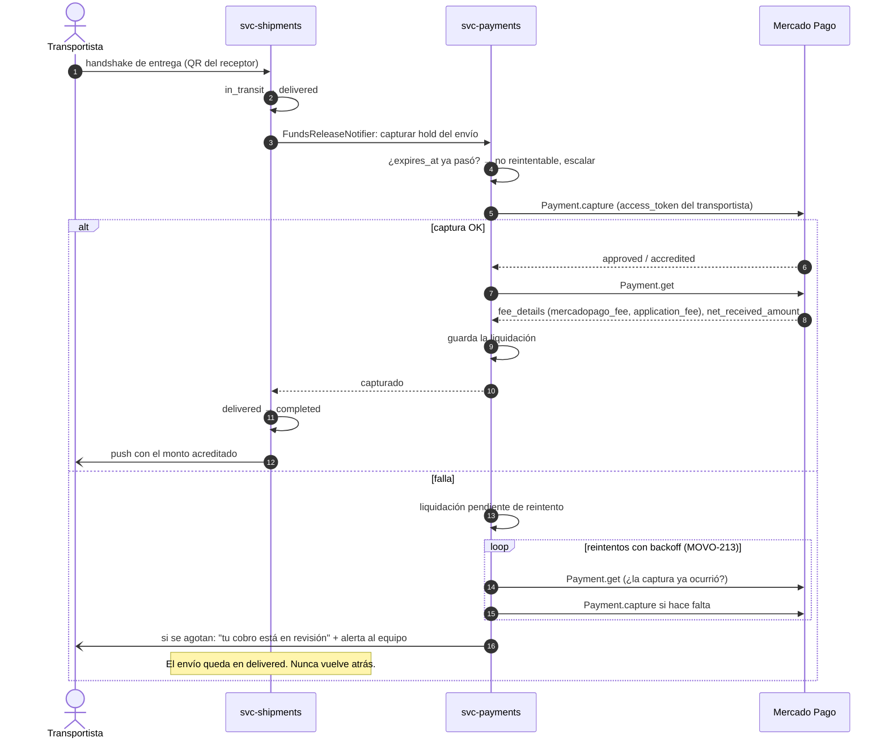
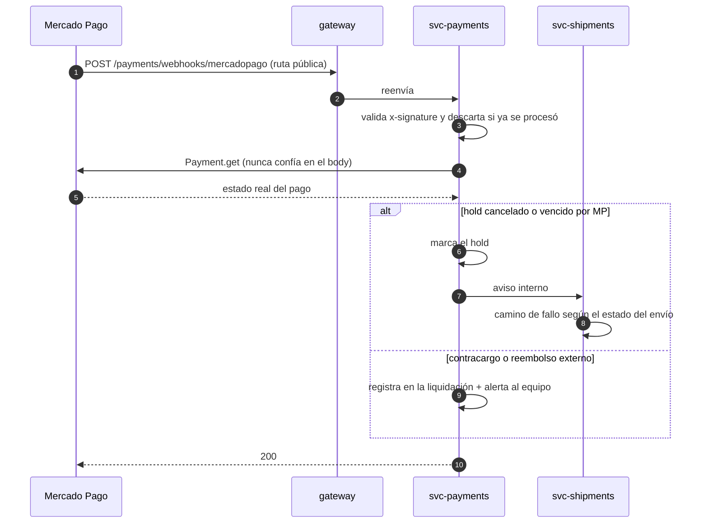
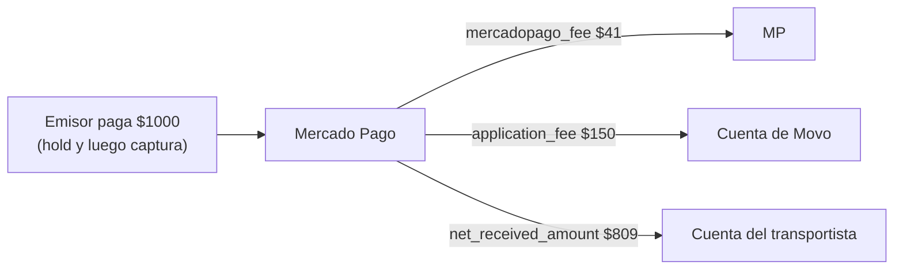
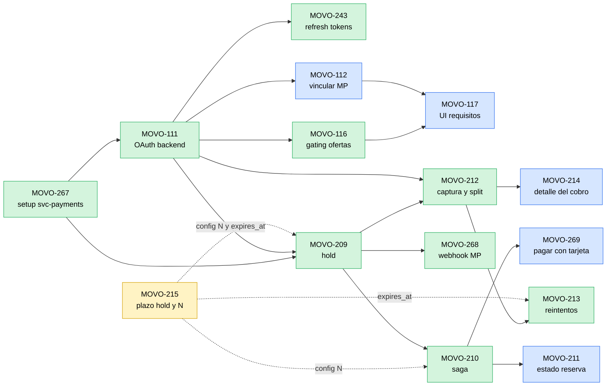

# Flujo de pagos de MOVO

Cómo circula el dinero de un envío, desde que el transportista vincula su cuenta de
Mercado Pago hasta que cobra. Refleja el diseño vigente al **29/09/2026**, después del
spike MOVO-49 y del rediseño de los tickets de pago en Linear (etiqueta **Pago**).

- Evidencia técnica del spike (requests reales, cuentas de sandbox, SDK vs API):
  `docs/payments/mercadopago-spike/SOLUCION-FINAL.md`.
- Estados del envío: `docs/shipments/state-diagram.md` (el código manda:
  `services/movo-svc-shipments/src/domain/shipment-state-machine.ts`).

Si el diseño cambia, se actualiza este documento en el mismo PR que el cambio.

---

## 1. Resumen en cinco líneas

1. El **transportista** vincula su cuenta de Mercado Pago a Movo (OAuth). Sin eso no puede ofertar.
2. Cuando el **emisor** acepta una oferta, paga con tarjeta desde la app. No se le cobra:
   se le **reserva** el monto (hold, `capture: false`).
3. La reserva se crea **cerca del retiro**, porque MP la cancela sola a los pocos días.
   Si el retiro está lejos, el emisor confirma el pago cuando se acerca la fecha.
4. Cuando el paquete se **entrega** (handshake), Movo **captura** el hold. MP reparte el
   dinero en el mismo momento: la comisión va a Movo y el resto al transportista (split).
5. Si algo falla antes del retiro, el envío vuelve a publicarse. Si falla después de la
   entrega, se reintenta y, si no alcanza, se escala a revisión manual.

---

## 2. Componentes y responsabilidades

| Componente | Qué hace en el flujo de pagos |
| --- | --- |
| `movo-mobile` | Vincula la cuenta de MP del transportista (navegador embebido). Muestra el formulario de tarjeta de MP y tokeniza en el dispositivo. Muestra el estado de la reserva y el detalle del cobro. |
| `gateway` | Punto de entrada único. Expone `/shipments/*` y `/payments/*` (OAuth y consultas), más dos rutas públicas: el callback de OAuth y el webhook de MP. |
| `movo-svc-shipments` | **Dueño de la saga.** Decide la ruta (cercana o lejana), transiciona estados, corre los jobs de vencimiento y es la única puerta del mobile para pagar un envío (`/shipments/:id/funding`). Llama a `svc-payments` por endpoints internos. |
| `movo-svc-payments` | **Único que habla con Mercado Pago.** Guarda los tokens OAuth de cada transportista. Crea, consulta, libera y captura holds. Persiste holds y liquidaciones, y recibe los webhooks de MP. |
| Mercado Pago | Procesa la tarjeta, retiene los fondos y, al capturar, reparte entre Movo (`application_fee`) y el transportista. |

---

## 3. Proceso general

Vista de punta a punta del ciclo de vida del pago de un envío, con los caminos de fallo.

Reglas que el diagrama no muestra explícitamente:

- **Un envío en `assigned_unfunded` nunca puede iniciar el retiro.** La máquina de
  estados rechaza `assigned_unfunded → in_transit`.
- **La entrega no se revierte.** Si la captura falla, el envío se queda en `delivered`:
  el handshake es un evento inmutable.
- **Un hold en `assignment_pending` solo existe por una falla a mitad de camino.** En el
  camino normal, crear el hold pasa el envío a `assigned` en el mismo paso (secuencia
  5.2). Si MP autoriza pero la transición en `svc-shipments` falla (caída, timeout o
  conflicto de concurrencia), queda un hold creado con el envío todavía en
  `assignment_pending`. Ese es el caso de compensación que tienen que cubrir MOVO-209/210
  (cómo se resuelve, reintentar la transición o liberar el hold, se define ahí). Si en
  ese estado el emisor cancela, el hold se **libera**.
- Cancelar desde `assigned` sigue bloqueado hasta definir la penalidad (MOVO-226).

---

## 4. Estados del envío que toca el pago

Subconjunto del DTE completo, solo con las transiciones que dispara el flujo de pagos.

| Estado | Qué significa para el dinero |
| --- | --- |
| `assignment_pending` | Oferta aceptada, esperando que el emisor pague ahora. |
| `assigned_unfunded` | Transportista confirmado, pago todavía no pedido (retiro lejano). |
| `assigned` | Hold activo: fondos retenidos en la tarjeta del emisor, no cobrados. |
| `in_transit` | Igual que `assigned`, con el paquete en viaje. |
| `delivered` | Entregado. La captura está en curso o en reintento. |
| `completed` | Capturado: Movo y el transportista ya cobraron. Único camino: MOVO-212. |

---

## 5. Diagramas de secuencia

### 5.1 Vinculación de la cuenta de MP del transportista (MOVO-110)

Una sola vez por transportista, antes de poder ofertar (MOVO-116 lo exige).

### 5.2 Aceptación de oferta con retiro cercano (MOVO-12)

El emisor paga en el mismo flujo en que acepta la oferta.

### 5.3 Retiro lejano: ventana de confirmación del pago (MOVO-210)

### 5.4 Entrega, captura y split (MOVO-13)

### 5.5 Eventos que inicia Mercado Pago (MOVO-268)

---

## 6. Cómo se reparte el dinero

Ejemplo real del sandbox (29/09/2026), envío de $1000 con comisión de Movo de 15%:

- El `application_fee` se fija **al crear el hold** y MP lo aplica **al capturar**.
  Antes de la captura el pago no muestra el split.
- Los dos fees los paga el **cobrador** (el transportista, `fee_payer: collector`):
  el emisor paga exactamente el precio acordado.
- El 4,1% de MP es del sandbox; el valor real depende del contrato (MOVO-225). La app
  hoy estima con `MP_TRANSACTION_FEE_RATE` de `@movo/shared`.
- Si se cancela un hold, no se cobra nada a nadie.

---

## 7. Decisiones de diseño y por qué

| Decisión | Motivo | Dónde |
| --- | --- | --- |
| Marketplace de MP: Payments API + OAuth del transportista + `application_fee` | Movo nunca toca el dinero del transportista: MP lo acredita directo en su cuenta y retiene la comisión de Movo en la misma operación. | MOVO-209, ADR-034 (a escribir) |
| La tarjeta se tokeniza con la `public_key` **del transportista** | Requisito de MP: el card_token tiene que pertenecer a la cuenta que cobra. Con otra key, error 2006. | Spike MOVO-49 |
| El hold se crea **siempre con el emisor presente** | Tarjeta guardada + cobro off-session no se pudo validar en marketplace (error 128 al guardarla; la variante con la cuenta de Movo no se puede probar en sandbox). | MOVO-12, SOLUCION-FINAL §7 |
| El hold se ancla **cerca del retiro**, no en la aceptación | MP cancela el hold a los pocos días. Si falla cerca del retiro, falla antes de la custodia, cuando todavía se puede republicar el envío. | MOVO-12 |
| **No** se renuevan holds vencidos | La renovación puede fallar con el paquete en tránsito, bloquea doble monto y parece un doble cobro. | MOVO-12 |
| `svc-shipments` es el dueño de la saga y la puerta del mobile | Los estados del envío viven ahí. `svc-payments` queda aislado como único integrador de MP. | MOVO-210 |
| SDK oficial `mercadopago` v3 (el canje de OAuth, aislado) | Mismo resultado que la API REST, con tipos, idempotencia y errores ya resueltos. `code_verifier`/`test_token` no están tipados. | MOVO-267, SOLUCION-FINAL §4 |
| Idempotencia en hold, captura, saga y webhook | Un doble hold retiene plata dos veces; una doble captura cobra dos veces. | MOVO-209, 210, 212, 268 |

**Costo aceptado de la ruta lejana:** el transportista se compromete sin fondos
reservados y sin validación previa de la tarjeta del emisor. Si el emisor no confirma, el
envío se republica. Se mitiga con recordatorios y aviso explícito al transportista.

---

## 8. Pasos del flujo → tickets de Linear

| Paso | Backend | Mobile | Historia |
| --- | --- | --- | --- |
| Base de `svc-payments` (Prisma, SDK, env vars, gateway) | MOVO-267 | — | — |
| Vincular la cuenta de MP del transportista | MOVO-111 | MOVO-112 | MOVO-110 |
| Renovar tokens OAuth automáticamente | MOVO-243 | — | MOVO-110 |
| Exigir licencia + MP para ofertar o declarar viaje | MOVO-116 | MOVO-117 | MOVO-110 (AC6) |
| Plazo real del hold y valor de N | MOVO-215 (spike) | — | MOVO-12 |
| Crear, consultar y liberar el hold | MOVO-209 | — | MOVO-12 |
| Saga: rutas, ventana de confirmación, timeouts, cancelación | MOVO-210 | — | MOVO-12 |
| Pagar con tarjeta (aceptación o confirmación) | — | MOVO-269 | MOVO-12 |
| Estado de la reserva en el detalle del envío | — | MOVO-211 | MOVO-12 |
| Webhook de MP (holds vencidos, contracargos) | MOVO-268 | — | MOVO-12 |
| Captura y split al entregar | MOVO-212 | — | MOVO-13 |
| Reintentos y escalado manual | MOVO-213 | — | MOVO-13 |
| Detalle del cobro (bruto, comisión, neto) | — | MOVO-214 | MOVO-13 |

**En Backlog, fuera del camino crítico:**

| Ticket | Por qué está en espera |
| --- | --- |
| MOVO-37 (+ MOVO-65, 100, 101) | Pago en efectivo: Movo le cobra la comisión a la tarjeta guardada del transportista. MOVO-65/100/101 quedaron solo para este caso. |
| MOVO-28 | Historial de transacciones del emisor. Depende de que existan liquidaciones (MOVO-212). |
| MOVO-226 | Penalidad por cancelar con transportista asignado. Falta la definición de negocio. |
| MOVO-225 | Fee real de MP para los Términos y Condiciones. Depende del contrato con MP. |

---

## 9. Orden de implementación

Las flechas son dependencias ("A → B": B necesita a A). Verde: backend; azul: mobile;
amarillo: spike.

### Fases sugeridas

| Fase | Backend | Mobile | Qué se puede demostrar al terminar |
| --- | --- | --- | --- |
| **0. Arranque** (en paralelo) | MOVO-267 | — | `svc-payments` desplegado y ruteado por el gateway. |
| | MOVO-215 (spike, corre en paralelo; la medición tarda días) | | |
| **1. Cuenta del transportista** | MOVO-111 | MOVO-112 (contra el contrato de 111) | Un transportista vincula su cuenta de MP desde la app. |
| **2. Reserva de fondos** | MOVO-209 → MOVO-210 | MOVO-269, MOVO-211 (contra el contrato de 210) | Aceptar una oferta, pagar y llegar a `assigned`: **se destraba el retiro real**, que hoy no tiene camino sin el devkit. |
| **3. Cobro** | MOVO-212 → MOVO-213 | MOVO-214 | Entregar y ver el split acreditado: flujo económico completo. |
| **4. Robustez y requisitos** | MOVO-268, MOVO-243, MOVO-116 | MOVO-117 | Vencimientos informados por MP, tokens que se renuevan solos y ofertas bloqueadas sin MP. |

Notas sobre el orden:

- **La fase 2 es el camino crítico de la demo.** Hoy ningún código lleva un envío de
  `assignment_pending` a `assigned`, y el handshake de retiro exige `assigned`.
- **Mobile arranca contra el contrato**, no contra el endpoint terminado: acordar rutas,
  payloads y códigos de error al inicio de cada par backend/mobile (mismo criterio que
  MOVO-100/101).
- MOVO-215 no bloquea el código: N y el plazo del hold son **configuración**. Se puede
  implementar con un valor provisorio (por ejemplo 5 días) y ajustarlo cuando termine
  la medición.
- MOVO-116 bloquea la creación de ofertas sin MP vinculado. Conviene activarlo recién
  cuando MOVO-112 esté en la app, para no dejar a los transportistas sin forma de
  cumplir el requisito.

---

## 10. Preguntas abiertas

| Pregunta | Dónde se resuelve |
| --- | --- |
| Plazo real del hold en Argentina y valor de N | MOVO-215 |
| ¿MP acepta un `redirect_uri` con esquema custom (`movo://`) o hace falta un callback `https://` en el backend? | MOVO-111 AC3 |
| ¿Cómo se embebe el formulario de tarjeta de MP en React Native, y acepta las cuentas de prueba? | MOVO-269 |
| ¿Producción exige homologar el modelo Marketplace en la cuenta real de Movo? | Hilo de soporte de MP (pregunta 3) |
| ¿Por qué el pagador figura con `payer.id 3612507366` y no con el ID del panel? | Hilo de soporte de MP |
