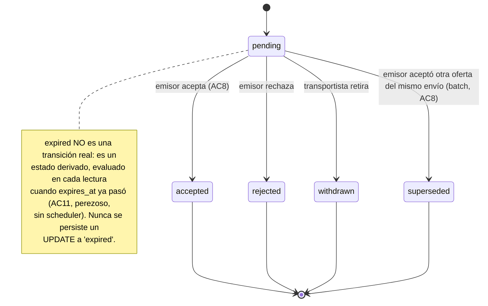

# MOVO-102 — DTE: ciclo de vida de la oferta (`OfferStatus`)

Diagrama de Transición de Estados (DTE) del set canónico de 6 estados cerrado en MOVO-102
(criterio 5). Mismo criterio que `docs/shipments/state-diagram.md` (MOVO-105): se modela acá
y en código (`services/movo-svc-shipments/src/domain/offer-state-machine.ts`); ese archivo es
la única fuente de verdad ejecutable, este diagrama se actualiza si el código cambia, no al
revés.

Una sola ronda de negociación (sin contraoferta): el transportista oferta, el emisor acepta o
rechaza. Si el emisor quiere otro precio, rechaza y el transportista vuelve a ofertar — eso es
una fila nueva, no una transición de ésta. Negociación encadenada (`parent_offer_id`) queda
como recorte de alcance explícito.

`accepted`, `rejected` y `withdrawn` son terminales por diseño. `expired` **no es una
transición real**: es un estado derivado (AC11), evaluado en cada lectura cuando `expires_at`
ya pasó y el valor persistido sigue siendo `pending` — no hay scheduler en el stack y este
ticket no introduce uno. `superseded` tampoco se alcanza vía una transición individual: se
aplica en lote, dentro de la misma transacción atómica que acepta otra oferta del mismo envío
(AC8).

## Transiciones inválidas (rechazadas explícitamente, ejemplos)

- `pending -> expired`: no es una transición ejecutable — `expired` solo se deriva en lectura
  (`deriveEffectiveOfferStatus`, `src/models/offer.ts`), nunca se llama
  `transition(pending, expired)` desde ningún repositorio.
- Cualquier transición saliente de un estado terminal (`accepted`, `rejected`, `withdrawn`,
  `superseded`, `expired`).
- Reversa de una transición válida (ej. `accepted -> pending`).
- Quedarse en el mismo estado (`pending -> pending`) no se modela como transición.

Ver `services/movo-svc-shipments/test/offer-state-machine.test.ts` para la cobertura
completa: las 4 transiciones válidas del diagrama + casos inválidos representativos de cada
categoría de arriba.

## Bloqueo optimista al aceptar (AC9)

Aceptar una oferta (`pending -> accepted`) no es solo una transición de dominio: dispara, en
una única transacción atómica (`offer-repository.ts#acceptOffer`), que las demás ofertas
`pending` del mismo envío pasen a `superseded` y que el envío pase a `assignment_pending`. Ese
último `UPDATE` condiciona por `status = 'published'` del envío — si otro emisor/proceso ya lo
cerró, la operación falla con `ShipmentNotAvailableForAssignmentError` en vez de aplicar una
segunda asignación. Detalle del mecanismo (sin `SELECT ... FOR UPDATE`, apoyado en el
row-lock implícito de Postgres bajo `UPDATE`) documentado como comentario en
`acceptOffer()`.

## Fuente original del diagrama

Modelado a partir del DTE de `shipment-state-machine.ts` (MOVO-105,
`docs/shipments/state-diagram.md`), adaptado al ciclo de vida —mucho más simple, una sola
ronda de negociación— de la oferta. Mismo criterio de versionado que el resto de
`docs/shipments/`: junto al código, no en Drive.
