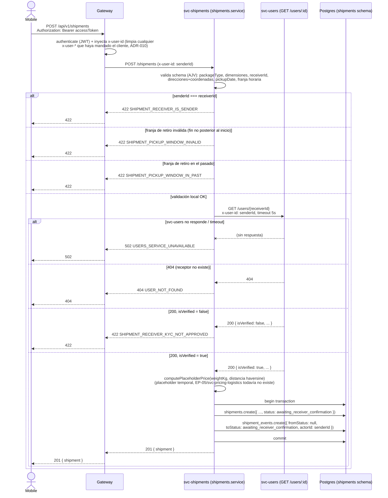

# MOVO-80 — Diagrama de secuencia: creación de envío

Flujo de `POST /api/v1/shipments`, incluyendo la llamada síncrona `svc-shipments` →
`svc-users` para validar al receptor (comunicación REST síncrona sin message broker,
ADR-001/ADR-005). Sirve como contrato visual del acoplamiento entre servicios — se
ajusta si algo cambia durante la implementación.

## Notas de diseño

- El `senderId` sale siempre del header `x-user-id` inyectado por el gateway — nunca
  del body (AC10). El schema de `POST /shipments` rechaza (`additionalProperties:
  false`) cualquier `senderId` que el cliente intente mandar, en vez de ignorarlo en
  silencio.
- El timeout de 5s en la llamada a `svc-users` (`src/adapters/users-client.ts`) es la
  contrapartida obligatoria de que sea una llamada síncrona: sin él, una demora en
  `svc-users` cuelga el request de creación de envío indefinidamente — el modo de
  falla clásico de los microservicios síncronos. Este acoplamiento (`svc-shipments`
  depende de la disponibilidad de `svc-users` para poder crear un envío) es un
  trade-off aceptado de la arquitectura REST síncrona sin broker (ADR-001), documentado
  acá para el paper.
- `GET /users/:id` ya devuelve `isVerified: boolean`, definido exactamente como
  `kycStatusIdentity === APPROVED` del lado de `svc-users` — no hace falta un segundo
  campo ni una segunda llamada para chequear el KYC del receptor.
