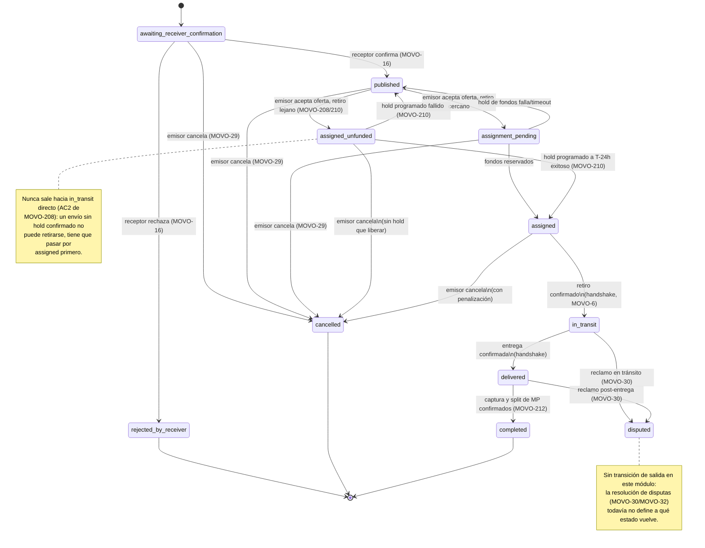

# MOVO-105 — DTE: ciclo de vida del envío (`ShipmentStatus`)

Diagrama de Transición de Estados (DTE) del set canónico de estados — 9 cerrados en
MOVO-79 (criterio 6), extendido a 11 por MOVO-208 (`assigned_unfunded`/`completed`).
Es el entregable académico directo de este módulo — se modeló primero acá (y como
adjunto en el issue de Linear) y después en código
(`services/movo-svc-shipments/src/domain/shipment-state-machine.ts`); ese archivo es la
única fuente de verdad ejecutable, este diagrama se actualiza si el código cambia, no al
revés.

`rejected_by_receiver`, `cancelled` y `completed` son terminales por diseño (MOVO-79/
MOVO-208). `disputed` tampoco tiene salida en este módulo: la resolución de una disputa
es responsabilidad de un admin (MOVO-30, panel en MOVO-32) y todavía no hay ticket que
defina a qué estado vuelve el envío — no se modela una transición inventada para no
adelantar una decisión que no está tomada.

`assigned_unfunded` (MOVO-208, decisión de arquitectura del hold de MOVO-12 "opción B"):
ruta alternativa a `assignment_pending` cuando el retiro es a más de N días — el hold de
Mercado Pago recién se programa a T-24h de la ventana de retiro, en vez de crearse al
aceptar la oferta. Ninguna de las dos transiciones nuevas se dispara todavía: `MOVO-210`
(saga de asignación) y `MOVO-212` (captura y split) las disparan, ambos bloqueados por
Mercado Pago.

## `delivery_failed`: evaluado y descartado explícitamente (MOVO-208)

No se agrega al set canónico. Hoy no tiene transiciones de salida definidas y sería un
estado al que se puede entrar sin saber cómo salir — peor que no tenerlo. Preguntas sin
responder antes de poder agregarlo: qué pasa con el hold de fondos (¿se libera? ¿se
reembolsa? ¿se paga parcialmente?), si el envío vuelve a `published` o queda cerrado,
quién puede declarar la falla (transportista/receptor/admin/timeout), si se diferencia
de `disputed`, y qué pasa con el paquete físico. Registrado como el hueco más importante
del camino de excepción — impacto concreto en `MOVO-199` (si el receptor no aparece, el
envío queda en `in_transit` indefinidamente).

## Transiciones inválidas (rechazadas explícitamente, ejemplos)

- Saltear estados intermedios (ej. `awaiting_receiver_confirmation` → `assigned`
  directo, sin pasar por `published`/`assignment_pending`).
- Cancelar desde `in_transit` o `delivered` — el diagrama solo permite cancelar hasta
  `assigned`/`assigned_unfunded` inclusive (con penalización desde `assigned`, sin
  penalización desde `assigned_unfunded` porque todavía no hay hold que liberar); a
  partir de `in_transit` la única salida de excepción es `disputed`.
- `assigned_unfunded` → `in_transit` directo (AC2 de MOVO-208): permitiría retirar un
  paquete sin fondos reservados.
- Cualquier transición saliente de un estado terminal (`rejected_by_receiver`,
  `cancelled`, `completed`) o de `disputed`.
- Quedarse en el mismo estado (`X` → `X`) no se modela como transición.

Ver `services/movo-svc-shipments/test/shipment-state-machine.test.ts` para la cobertura
completa: las 18 transiciones válidas del diagrama + casos inválidos representativos de
cada categoría de arriba.

## Fuente original del diagrama

Modelado primero fuera del repo (Drive, `Maquina de estados Shipment.jpg`/`.pdf`) y
adjuntado al issue de Linear (MOVO-105) — este archivo es la transcripción a Mermaid
versionada junto al código, mismo criterio que `docs/kyc/state-diagram.md` (MOVO-72).
La extensión de MOVO-208 (`assigned_unfunded`/`completed`) se modeló directamente acá,
sin un diagrama fuente aparte en Drive — ver ADR-021 (`CLAUDE.md` raíz) para el
razonamiento completo de por qué se agregan estos dos estados y no `delivery_failed`.
