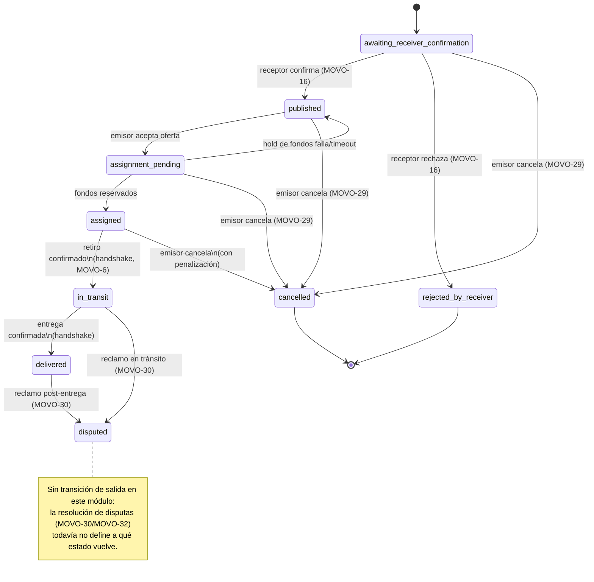

# MOVO-105 — DTE: ciclo de vida del envío (`ShipmentStatus`)

Diagrama de Transición de Estados (DTE) del set canónico de 9 estados cerrado en MOVO-79
(criterio 6). Es el entregable académico directo de este módulo — se modeló primero acá
(y como adjunto en el issue de Linear) y después en código
(`services/movo-svc-shipments/src/domain/shipment-state-machine.ts`); ese archivo es la
única fuente de verdad ejecutable, este diagrama se actualiza si el código cambia, no al
revés.

`rejected_by_receiver` y `cancelled` son terminales por diseño (MOVO-79). `disputed`
tampoco tiene salida en este módulo: la resolución de una disputa es responsabilidad de
un admin (MOVO-30, panel en MOVO-32) y todavía no hay ticket que defina a qué estado
vuelve el envío — no se modela una transición inventada para no adelantar una decisión
que no está tomada.

## Transiciones inválidas (rechazadas explícitamente, ejemplos)

- Saltear estados intermedios (ej. `awaiting_receiver_confirmation` → `assigned`
  directo, sin pasar por `published`/`assignment_pending`).
- Cancelar desde `in_transit` o `delivered` — el diagrama solo permite cancelar hasta
  `assigned` inclusive (con penalización en ese último caso); a partir de
  `in_transit` la única salida de excepción es `disputed`.
- Cualquier transición saliente de un estado terminal (`rejected_by_receiver`,
  `cancelled`) o de `disputed`.
- Quedarse en el mismo estado (`X` → `X`) no se modela como transición.

Ver `services/movo-svc-shipments/test/shipment-state-machine.test.ts` para la cobertura
completa: las 13 transiciones válidas del diagrama + casos inválidos representativos de
cada categoría de arriba.

## Fuente original del diagrama

Modelado primero fuera del repo (Drive, `Maquina de estados Shipment.jpg`/`.pdf`) y
adjuntado al issue de Linear (MOVO-105) — este archivo es la transcripción a Mermaid
versionada junto al código, mismo criterio que `docs/kyc/state-diagram.md` (MOVO-72).
