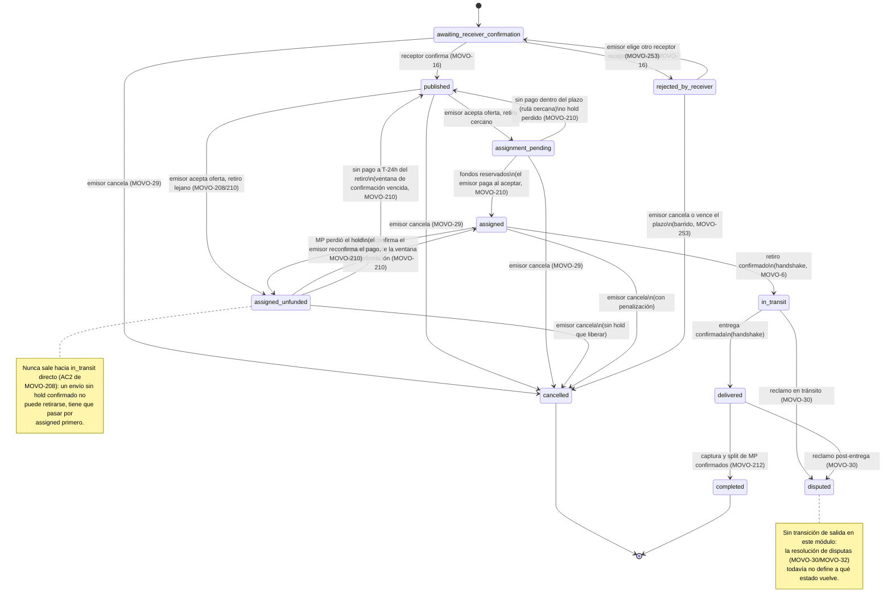

# MOVO-105 — DTE: ciclo de vida del envío (`ShipmentStatus`)

Diagrama de Transición de Estados (DTE) del set canónico de estados — 9 cerrados en
MOVO-79 (criterio 6), extendido a 11 por MOVO-208 (`assigned_unfunded`/`completed`).
Es el entregable académico directo de este módulo — se modeló primero acá (y como
adjunto en el issue de Linear) y después en código
(`services/movo-svc-shipments/src/domain/shipment-state-machine.ts`); ese archivo es la
única fuente de verdad ejecutable, este diagrama se actualiza si el código cambia, no al
revés.

`cancelled` y `completed` son terminales por diseño (MOVO-79/MOVO-208).
`rejected_by_receiver` lo fue hasta MOVO-253 (ADR-027): ahora el emisor tiene un plazo
(`receiver_redesignation_deadline`, 48hs con tope en la ventana de retiro) para elegir
otro receptor o cancelar, y si no hace ninguna de las dos el barrido lo pasa a
`cancelled`. El rechazo no se pierde: queda como evento en la línea de tiempo.
`disputed` tampoco tiene salida en este módulo: la resolución de una disputa
es responsabilidad de un admin (MOVO-30, panel en MOVO-32) y todavía no hay ticket que
defina a qué estado vuelve el envío — no se modela una transición inventada para no
adelantar una decisión que no está tomada.

`assigned_unfunded` (MOVO-208, hold anclado cerca del retiro según MOVO-12): ruta
alternativa a `assignment_pending` cuando el retiro es a más de N días. Al aceptar la
oferta no se crea el hold: cuando el retiro entra en N días se abre una ventana y el
emisor confirma el pago con la app abierta, lo que crea el hold y pasa a `assigned`.
Si no pagó a T-24h del retiro, el envío vuelve a `published`. No hay hold programado
automático: tarjeta guardada + cobro sin el emisor presente no se pudo validar en
marketplace (`docs/payments/mercadopago-spike/SOLUCION-FINAL.md` §7). Flujo completo
en `docs/payments/flujo-de-pagos.md` §5.3. `MOVO-210` (saga de asignación) dispara las
transiciones de `assignment_pending`/`assigned_unfunded`; `MOVO-212` (captura y split)
dispara `delivered → completed`.

### Las dos rutas de la saga de asignación (MOVO-210)

Al aceptar una oferta, `acceptOffer` elige la ruta según la anticipación del retiro
acordado (inicio de la ventana de retiro efectiva, `domain/funding.ts#selectFundingRoute`).
`N` y los plazos salen de configuración (`FUNDING_*`, provisorios hasta MOVO-215):

| Ruta | Condición | Al aceptar | Pago | Plazo | Si no paga |
| --- | --- | --- | --- | --- | --- |
| Cercana | retiro a **N días o menos** (inclusive) | `published → assignment_pending` | el emisor paga en el mismo flujo | `FUNDING_PAYMENT_TIMEOUT_MINUTES` desde que acepta (tope: cierre de la ventana de retiro) | barrido: `→ published`, hold liberado, aviso a ambos |
| Lejana | retiro a **más de N días** | `published → assigned_unfunded` (sin tarjeta) | **ventana de confirmación**: abre cuando el retiro entra en N días | hasta **T-24h** del inicio del retiro (`FUNDING_RELEASE_HOURS_BEFORE_PICKUP`) | barrido: `→ published`, aviso obligatorio a ambos |

En ambas rutas, pagar (`POST /shipments/:id/funding`) con el hold autorizado lleva a
`assigned`. Un rechazo de tarjeta no cambia el estado: el emisor reintenta mientras no
venza el plazo. Volver a `published` desasigna al transportista (`carrierId` y precio
acordado en `null`), restaura la ventana de retiro original (MOVO-258 D3) y deja la
oferta aceptada como `rejected`. Las demás ofertas ya quedaron `superseded` al aceptar y
no se reabren: el emisor recibe ofertas nuevas.

**Reconfirmación (`assigned → assigned_unfunded`, MOVO-210)**: si MP cancela o vence el hold
de un envío ya `assigned`, el envío NO se libera: vuelve a `assigned_unfunded` y el emisor
recibe el aviso "La reserva de tu pago expiró — Confirmá el pago de nuevo para asegurar tu
envío". Reconfirma con los mismos `GET`/`POST /shipments/:id/funding`; si no paga a T-24h
(o, con el retiro a menos de 24h, dentro de `FUNDING_PAYMENT_TIMEOUT_MINUTES` desde que
volvió a ese estado) el barrido lo devuelve a `published`. Es la única salida de
`assigned` además de `in_transit` y `cancelled`: nunca va directo a `published`.

```mermaid
stateDiagram-v2
    [*] --> awaiting_receiver_confirmation

    awaiting_receiver_confirmation --> published: receptor confirma (MOVO-16)
    awaiting_receiver_confirmation --> rejected_by_receiver: receptor rechaza (MOVO-16)
    awaiting_receiver_confirmation --> cancelled: emisor cancela (MOVO-29)

    published --> assignment_pending: emisor acepta oferta, retiro cercano
    published --> assigned_unfunded: emisor acepta oferta, retiro lejano (MOVO-208/210)
    published --> cancelled: emisor cancela (MOVO-29)

    assignment_pending --> published: sin pago dentro del plazo (ruta cercana)\no hold perdido (MOVO-210)
    assignment_pending --> assigned: fondos reservados\n(el emisor paga al aceptar, MOVO-210)
    assignment_pending --> cancelled: emisor cancela (MOVO-29)

    assigned_unfunded --> assigned: emisor confirma el pago\ndentro de la ventana de confirmación (MOVO-210)
    assigned_unfunded --> published: sin pago a T-24h del retiro\n(ventana de confirmación vencida, MOVO-210)
    assigned_unfunded --> cancelled: emisor cancela\n(sin hold que liberar)

    assigned --> assigned_unfunded: MP perdió el hold\n(el emisor reconfirma el pago, MOVO-210)
    assigned --> in_transit: retiro confirmado\n(handshake, MOVO-6)
    assigned --> cancelled: emisor cancela\n(con penalización)

    in_transit --> delivered: entrega confirmada\n(handshake)
    in_transit --> disputed: reclamo en tránsito (MOVO-30)

    delivered --> completed: captura y split de MP confirmados (MOVO-212)
    delivered --> disputed: reclamo post-entrega (MOVO-30)

    rejected_by_receiver --> awaiting_receiver_confirmation: emisor elige otro receptor (MOVO-253)
    rejected_by_receiver --> cancelled: emisor cancela o vence el plazo\n(barrido, MOVO-253)
    cancelled --> [*]
    completed --> [*]

    note right of disputed
        Sin transición de salida en este módulo:
        la resolución de disputas (MOVO-30/MOVO-32)
        todavía no define a qué estado vuelve.
    end note

    note right of assigned_unfunded
        Nunca sale hacia in_transit directo (AC2 de
        MOVO-208): un envío sin hold confirmado no
        puede retirarse, tiene que pasar por
        assigned primero.
    end note
```

## `delivery_failed`: evaluado y descartado explícitamente (MOVO-208)

No se agrega al set canónico. Hoy no tiene transiciones de salida definidas y sería un
estado al que se puede entrar sin saber cómo salir — peor que no tenerlo. Preguntas sin
responder antes de poder agregarlo: qué pasa con el hold de fondos (¿se libera? ¿se
reembolsa? ¿se paga parcialmente?), si el envío vuelve a `published` o queda cerrado,
quién puede declarar la falla (transportista/receptor/admin/timeout), si se diferencia
de `disputed`, y qué pasa con el paquete físico. Registrado como el hueco más importante
del camino de excepción — impacto concreto en `MOVO-199` (si el receptor no aparece, el
envío queda en `in_transit` indefinidamente).

## Transiciones inválidas (rechazadas explícitamente, ejemplos)

- Saltear estados intermedios (ej. `awaiting_receiver_confirmation` → `assigned`
  directo, sin pasar por `published`/`assignment_pending`).
- Cancelar desde `in_transit` o `delivered` — el diagrama solo permite cancelar hasta
  `assigned`/`assigned_unfunded` inclusive (con penalización desde `assigned`, sin
  penalización desde `assigned_unfunded` porque todavía no hay hold que liberar); a
  partir de `in_transit` la única salida de excepción es `disputed`.
- `assigned_unfunded` → `in_transit` directo (AC2 de MOVO-208): permitiría retirar un
  paquete sin fondos reservados.
- Cualquier transición saliente de un estado terminal (`cancelled`, `completed`) o de
  `disputed`.
- `rejected_by_receiver` → `published` directo: el receptor nuevo tiene que confirmar.
- Quedarse en el mismo estado (`X` → `X`) no se modela como transición.

Ver `services/movo-svc-shipments/test/shipment-state-machine.test.ts` para la cobertura
completa: las 20 transiciones válidas del diagrama + casos inválidos representativos de
cada categoría de arriba.

## Fuente original del diagrama

Modelado primero fuera del repo (Drive, `Maquina de estados Shipment.jpg`/`.pdf`) y
adjuntado al issue de Linear (MOVO-105) — este archivo es la transcripción a Mermaid
versionada junto al código, mismo criterio que `docs/kyc/state-diagram.md` (MOVO-72).
La extensión de MOVO-208 (`assigned_unfunded`/`completed`) se modeló directamente acá,
sin un diagrama fuente aparte en Drive — ver ADR-021 (`CLAUDE.md` raíz) para el
razonamiento completo de por qué se agregan estos dos estados y no `delivery_failed`.
